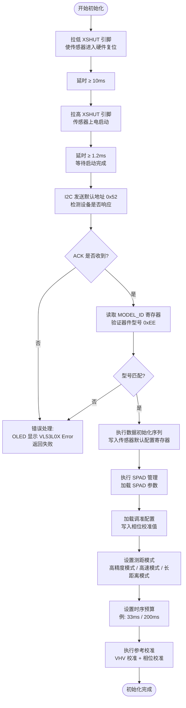
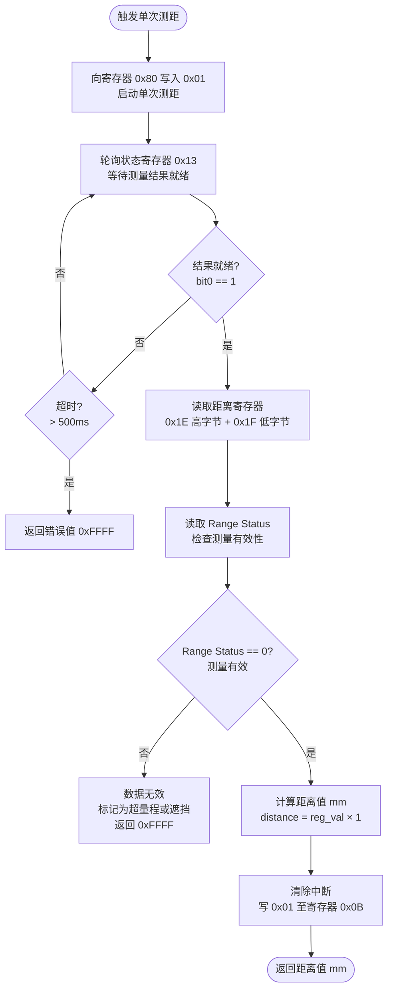
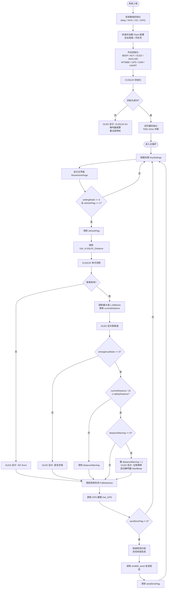
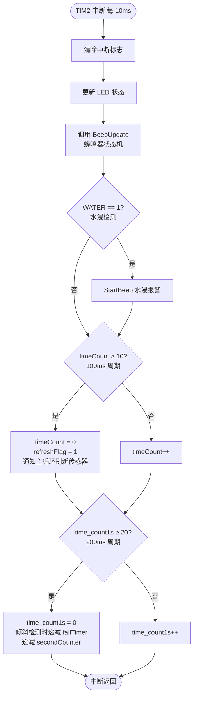

# VL53L0X 程序流程图

本文档描述了在智能盲杖系统中集成 VL53L0X 飞行时间（ToF）激光测距传感器的程序流程。

---

## 一、VL53L0X 初始化流程

---

## 二、单次测距流程

---

## 三、主程序集成流程

---

## 四、TIM2 中断中的定时调度

---

## 五、VL53L0X 与 HC-SR04 对比

| 特性 | HC-SR04（当前方案） | VL53L0X（ToF 方案） |
|------|------------------|-------------------|
| 测距原理 | 超声波时差 | 激光飞行时间 |
| 测距范围 | 2 cm – 450 cm | 3 cm – 200 cm（标准） |
| 精度 | ±3 mm | ±3% |
| 接口 | GPIO 触发 / 回响 | I2C（已有 PC14/PC15） |
| 受干扰因素 | 温度、风速、声噪 | 强光、镜面反射 |
| 功耗 | 较高 | 低（3.3V, < 20mA） |
| STM32 引脚占用 | PB4(Trig) + PB5(Echo) | PC14(SCL) + PC15(SDA) + 1×GPIO(XSHUT) |

> **说明**：VL53L0X 通过 I2C 与 STM32 通信，复用现有 `iic.c` 中的软件 I2C 即可驱动，无需额外修改硬件接口。XSHUT 引脚可连接至任意空闲 GPIO，用于硬件复位传感器。

---

## 六、关键寄存器说明

| 寄存器地址 | 名称 | 作用 |
|----------|------|------|
| 0xC0 | MODEL_ID | 器件型号（应读取 0xEE） |
| 0x80 | SYSRANGE_START | 写 0x01 触发单次测距 |
| 0x13 | RESULT_INTERRUPT_STATUS | bit0=1 表示结果就绪 |
| 0x1E–0x1F | RESULT_RANGE_STATUS(10-11) | 距离结果高低字节（mm） |
| 0x0B | SYSTEM_INTERRUPT_CLEAR | 写 0x01 清除中断 |
| 0x14 | RESULT_RANGE_STATUS | Range Status（0=有效） |

---

> **注意**：本流程图基于 VL53L0X API 标准操作流程设计，结合本项目 STM32F103 平台的软件 I2C 实现。实际移植时需根据 ST 官方 API 文档（UM2029）进行寄存器序列的精确对齐。
