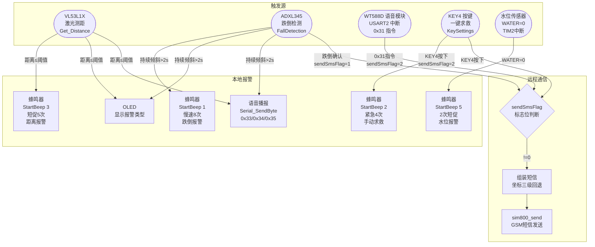
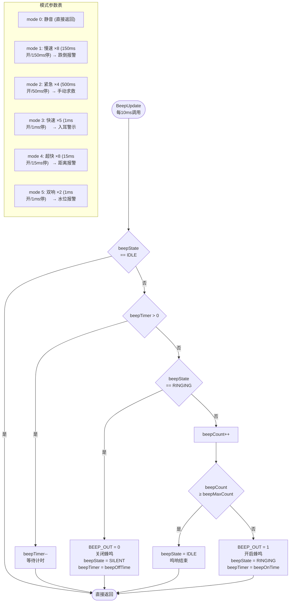
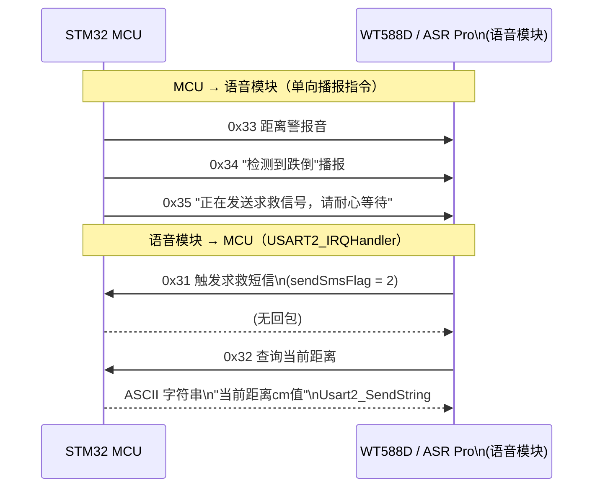
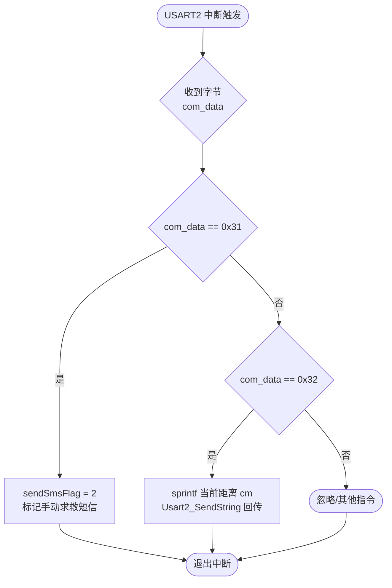
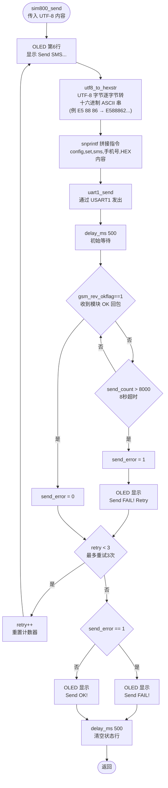
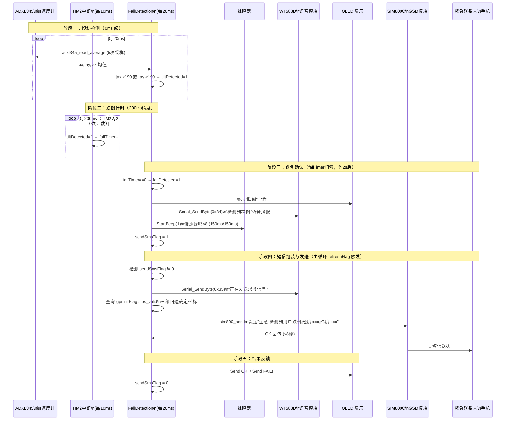

# 智能导盲杖 · 报警与通信机制流程图

> 目标平台：STM32F103  
> 报警输出：蜂鸣器（PC13）· WT588D 语音模块（USART2）· OLED 显示  
> 通信输出：SIM800C GSM 模块（USART1）短信

---

## 1. 报警触发总览图

三条独立触发路径最终汇聚到同一条"组装短信→发送"链路。



---

## 2. 蜂鸣器报警状态机（wt588d.c · BeepUpdate）

蜂鸣器通过 TIM2 中断（每 10ms）驱动，6 种鸣响模式对应不同告警场景。



---

## 3. 语音模块双向通信协议（USART2 中断）

WT588D / ASR Pro 语音模块与 MCU 之间通过 USART2 互传单字节指令。





---

## 4. 定位坐标三级回退机制

```mermaid
flowchart TD
    A([sendSmsFlag != 0\n需要发送短信]) --> B{gpsInitFlag == 1\nGPS 已锁定}
    B -- 是 --> C[使用 GPS 坐标\nGPS.longitude_Degree\nGPS.latitude_Degree]
    B -- 否 --> D{lbs_valid == 1\n基站坐标有效}
    D -- 是 --> E[使用基站 LBS 坐标\nlbs_longitude\nlbs_latitude\n附加标注"(基站)"]
    D -- 否 --> F[坐标填写"未知"]

    C --> G[组装短信:\n跌倒/求救 + 经纬度]
    E --> G
    F --> G
    G --> H[sim800_send\n发送短信]
    H --> I[sendSmsFlag = 0\n清除标志]

    subgraph LBS 周期重试
        J{gpsInitFlag==0\n且 lbs_valid==0} -- 约30秒 --> K[gsm_get_lbs\n重新查询基站坐标]
        K -- 成功 --> L[lbs_valid = 1]
        K -- 失败 --> J
    end
```

---

## 5. GSM 模块初始化与基站定位流程（gsm.c）

```mermaid
flowchart TD
    subgraph gsm_init["gsm_init · 短信功能初始化"]
        A1([开始]) --> A2[uart1_send\nconfig,set,smson,1,0,0,0,0,1,1]
        A2 --> A3{gsm_rev_okflag==1\n收到 OK 回包}
        A3 -- 否 --> A4{waittry > 3000\n3秒超时}
        A4 -- 否 --> A3
        A4 -- 是 --> A2
        A3 -- 是 --> A5([初始化完成])
    end

    subgraph gsm_lbs_init["gsm_lbs_init · 基站定位初始化"]
        B1([开始]) --> B2[uart1_send\nconfig,set,location,1,1,60,0,0,0,0]
        B2 --> B3{gsm_rev_okflag==1\n5秒超时等待}
        B3 -- 超时/成功 --> B4([返回])
    end

    subgraph gsm_get_lbs["gsm_get_lbs · 查询基站坐标"]
        C1([开始]) --> C2[清空接收缓冲区\nuart1_send: config,get,lbsloc]
        C2 --> C3{gsm_rev_okflag==1\n最长60秒等待}
        C3 -- 超时 --> C4([返回 0\n失败])
        C3 -- 收到OK --> C5[delay_ms 300\n等待剩余字节]
        C5 --> C6[查找 lbsloc,ok,]
        C6 --> C7{找到标记}
        C7 -- 否 --> C4
        C7 -- 是 --> C8[atof 解析经度\natof 解析纬度]
        C8 --> C9{lon==0 且 lat==0}
        C9 -- 是 --> C4
        C9 -- 否 --> C10([返回 1\n成功，经纬度已写入])
    end
```



---

## 6. 短信发送完整链路（gsm.c · sim800_send + gsm_send_msg）



---

## 7. 报警与通信端到端时序图

展示从事件发生到短信送达的完整时间线（以跌倒场景为例）。



---

## 8. 三种告警场景对比表

| 场景 | 触发条件 | 蜂鸣模式 | 语音指令 | 短信内容前缀 | sendSmsFlag |
|------|---------|---------|---------|------------|------------|
| **距离报警** | 测距 ≤ 安全阈值 | mode 3（快速5次） | 0x33 | — (不发短信) | 不变 |
| **跌倒报警** | 持续倾斜 > 2s | mode 1（慢速8次） | 0x34 | "注意,检测到用户跌倒" | = 1 |
| **手动求救** | KEY4 / WT 0x31 | mode 2（紧急4次） | — | "用户主动求救,需要紧急救援" | = 2 |
| **水位报警** | WATER=0（TIM2） | mode 5（双响2次） | — | — (不发短信) | 不变 |
| **取消报警** | KEY5 / 倾斜消除 | StopBeep() | — | — | 不变 |
