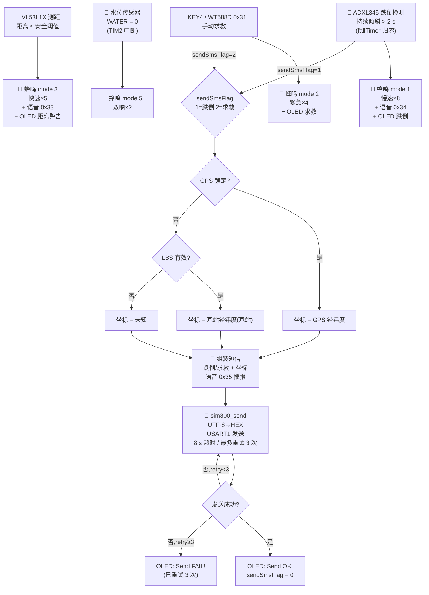

# 智能导盲杖 · 报警与通信机制流程图

> 目标平台：STM32F103 · 报警：蜂鸣器 / WT588D 语音 / OLED · 通信：SIM800C GSM 短信

```mermaid
flowchart TD
    %% ── 触发源 ──────────────────────────────────────────
    A1["🔵 VL53L1X 测距\n距离 ≤ 安全阈值"]
    A2["🔵 ADXL345 跌倒检测\n持续倾斜 > 2 s\n(fallTimer 归零)"]
    A3["🔵 KEY4 / WT588D 0x31\n手动求救"]
    A4["🔵 水位传感器\nWATER = 0\n(TIM2 中断)"]

    %% ── 本地报警 ─────────────────────────────────────────
    B1["📢 蜂鸣 mode 3\n快速×5\n+ 语音 0x33\n+ OLED 距离警告"]
    B2["📢 蜂鸣 mode 1\n慢速×8\n+ 语音 0x34\n+ OLED 跌倒"]
    B3["📢 蜂鸣 mode 2\n紧急×4\n+ OLED 求救"]
    B4["📢 蜂鸣 mode 5\n双响×2"]

    %% ── 短信触发 ─────────────────────────────────────────
    C{"sendSmsFlag\n1=跌倒  2=求救"}

    %% ── 坐标回退 ─────────────────────────────────────────
    D1{"GPS 锁定?"}
    D2{"LBS 有效?"}
    D3["坐标 = GPS 经纬度"]
    D4["坐标 = 基站经纬度(基站)"]
    D5["坐标 = 未知"]

    %% ── 短信发送 ─────────────────────────────────────────
    E["📝 组装短信\n跌倒/求救 + 坐标\n语音 0x35 播报"]
    F["📡 sim800_send\nUTF-8→HEX\nUSART1 发送\n8 s 超时 / 最多重试 3 次"]
    G{"发送成功?"}
    H["OLED: Send OK!\nsendSmsFlag = 0"]
    I["OLED: Send FAIL!\n(已重试 3 次)"]

    %% ── 连线 ─────────────────────────────────────────────
    A1 --> B1
    A2 --> B2
    A2 -- "sendSmsFlag=1" --> C
    A3 --> B3
    A3 -- "sendSmsFlag=2" --> C
    A4 --> B4

    C --> D1
    D1 -- 是 --> D3
    D1 -- 否 --> D2
    D2 -- 是 --> D4
    D2 -- 否 --> D5
    D3 & D4 & D5 --> E
    E --> F
    F --> G
    G -- 是 --> H
    G -- 否,retry<3 --> F
    G -- 否,retry≥3 --> I
```
