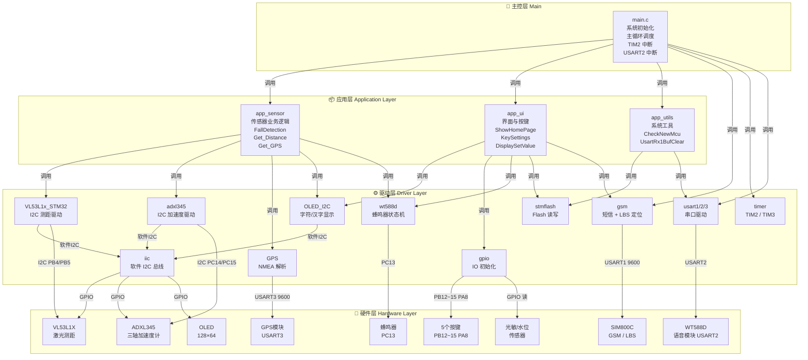
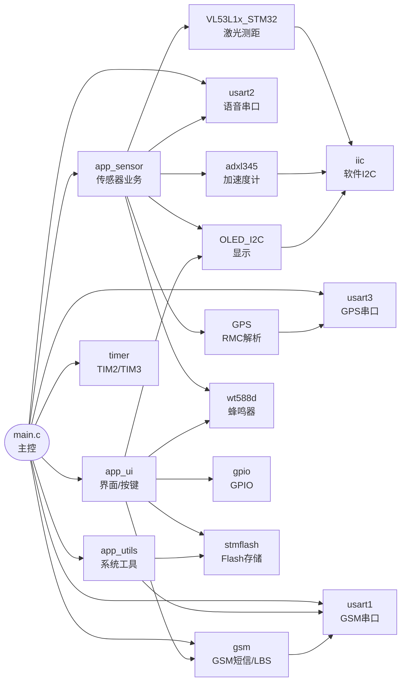
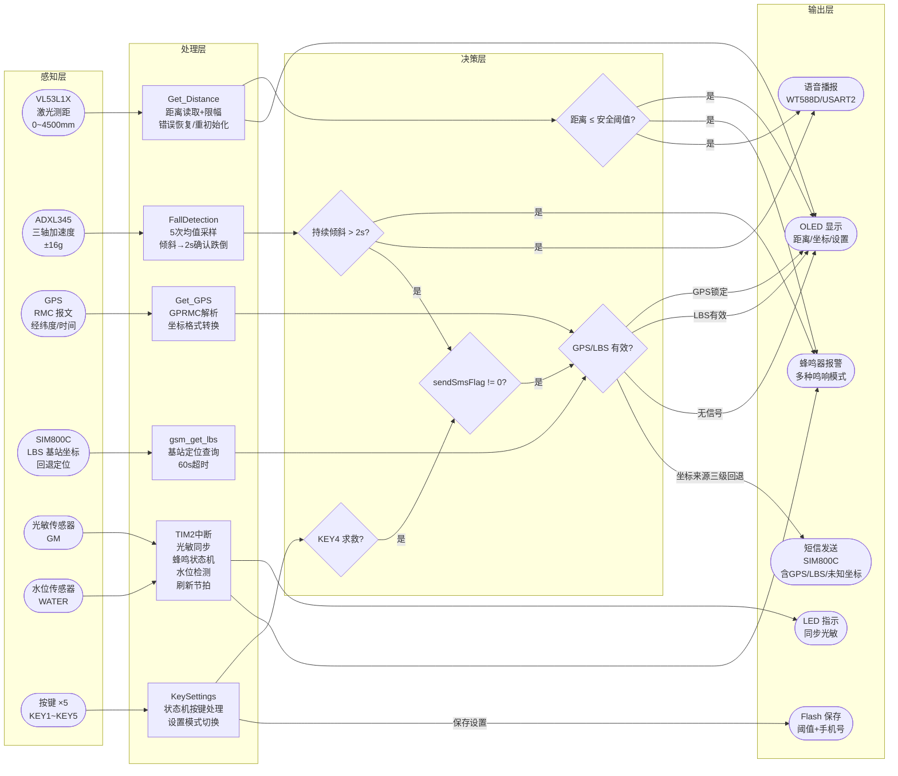
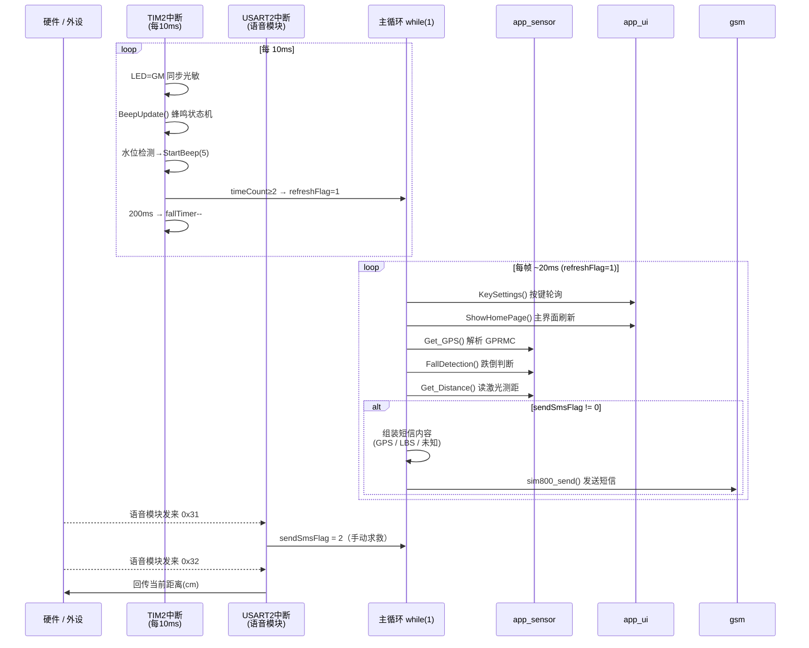
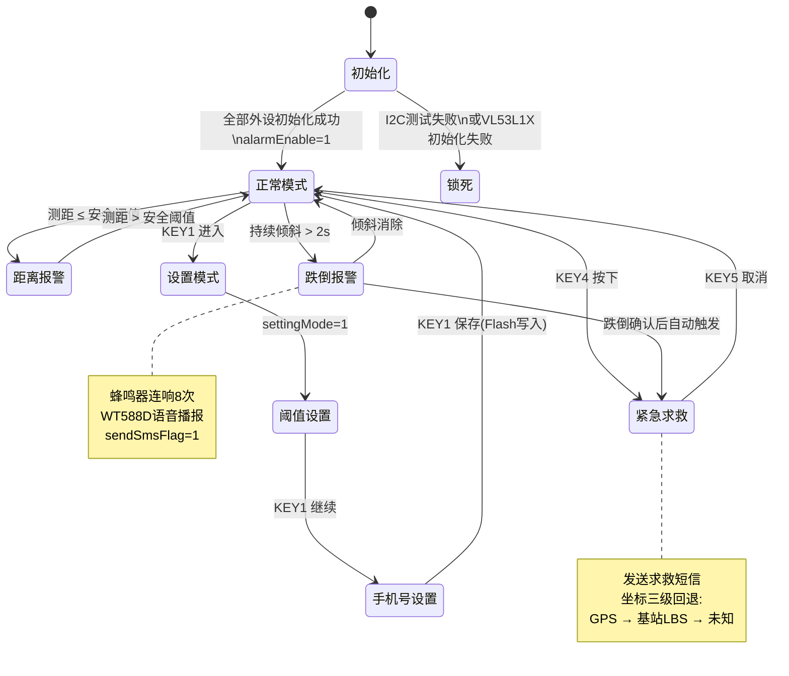

# 智能导盲杖 · 软件总体设计

> 目标平台：STM32F103（72 MHz Cortex-M3）  
> 开发环境：Keil MDK · 标准外设库（StdPeriph）

---

## 1. 软件分层架构图

---

## 2. 模块依赖关系图

---

## 3. 数据与信号流图

---

## 4. 中断与主循环协作时序图

---

## 5. 系统状态机总览

---

## 6. 各模块职责一览

| 模块文件 | 所在层 | 核心职责 |
|---------|--------|---------|
| `main.c` | 主控层 | 系统初始化、主循环调度、TIM2/USART2 中断 |
| `app_sensor.c` | 应用层 | 跌倒检测、激光测距、GPS 数据获取 |
| `app_ui.c` | 应用层 | OLED 界面显示、5 键状态机设置 |
| `app_utils.c` | 应用层 | MCU 首次上电初始化、串口缓冲区清空 |
| `gsm.c` | 驱动层 | SIM800C 短信发送（UTF-8→HEX）、LBS 基站定位 |
| `GPS.c` | 驱动层 | NMEA-0183 GPRMC/GPGGA 解析、UTC→北京时间 |
| `adxl345.c` | 驱动层 | ADXL345 寄存器读写、三轴采样与均值计算 |
| `VL53L1x_STM32.c` | 驱动层 | VL53L1X 初始化、单次测距读取、错误诊断 |
| `OLED_I2C.c` | 驱动层 | SSD1306 字符/汉字显示（软件 I2C） |
| `wt588d.c` | 驱动层 | 蜂鸣器 PWM 状态机（6 种鸣响模式） |
| `iic.c` | 驱动层 | 软件模拟 I2C 时序（Start/Stop/Byte/ACK） |
| `gpio.c` | 驱动层 | GPIO 统一初始化（LED/蜂鸣/按键/传感器） |
| `timer.c` | 驱动层 | TIM2（系统节拍 10ms）、TIM3（超声波计时） |
| `stmflash.c` | 驱动层 | 内部 Flash 读写（手机号 + 安全距离持久化） |
| `usart1/2/3.c` | 驱动层 | 三路串口（GSM / 语音模块 / GPS） |
