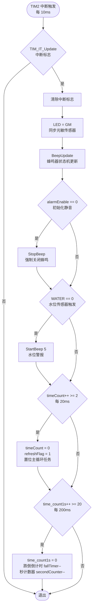
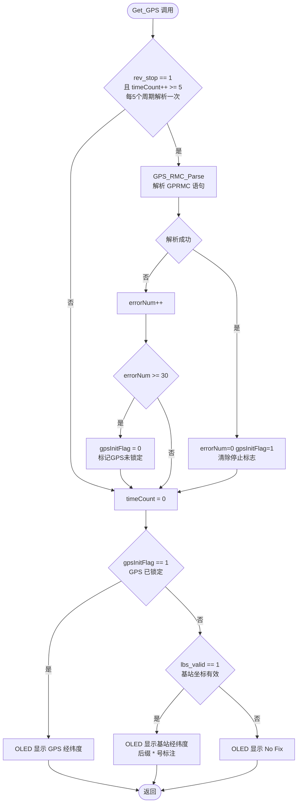
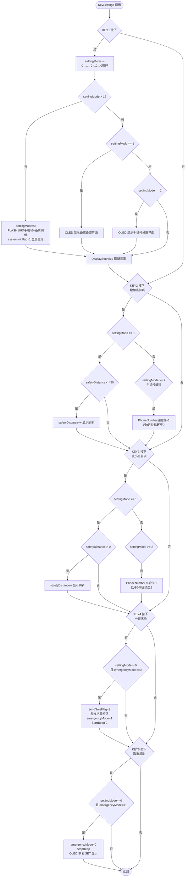
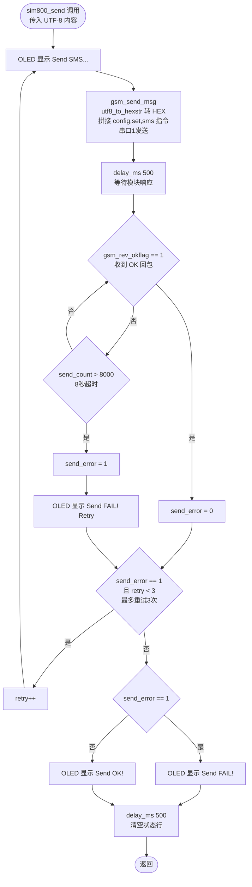

# 智能导盲杖程序流程图

> 目标平台：STM32F103  
> 主要外设：VL53L1X（激光测距）· ADXL345（跌倒检测）· GPS（定位）· SIM800C（GSM短信）· OLED（显示）

---

## 1. 主程序流程图（main.c）

```mermaid
flowchart TD
    A([上电复位]) --> B[延时初始化\ndelay_init]
    B --> C[NVIC 中断向量配置]
    C --> D[I2C 总线初始化\nI2C_Configuration]
    D --> E[CheckNewMcu\n检查/写入MCU标识]
    E --> F[外设 GPIO 初始化\n蜂鸣器·按键·LED\nWT588D·IIC]
    F --> G[ADXL345 加速度计初始化]
    G --> H[OLED 初始化 & 清屏]
    H --> I[VL53L1X I2C 初始化]

    I --> J{VL53L1X_I2C_Test\nI2C通信测试}
    J -- 失败 --> K[OLED 显示错误诊断信息\n总线扫描·寄存器读取\nBoot状态检查]
    K --> L([系统锁死\nwhile 1])
    J -- 通过 --> M[读取器件ID\n0xEA/0xEB=正常]

    M --> N{VL53L1X_Init 初始化\n最多重试3次}
    N -- 全部失败 --> O[OLED 显示初始化失败\n及接线提示]
    O --> L
    N -- 成功 --> P{VL53L1X_StartRanging\n启动测距，最多5次重试}
    P -- 失败 --> Q[非致命：记录失败\n继续运行]
    P -- 成功 --> Q

    Q --> R[串口初始化\nUSART1 9600·USART2·USART3 9600]
    R --> S[定时器初始化\nTIM2 50ms中断·TIM3 超声波计时]
    S --> T[GSM 模块初始化\ngsm_init 等待 OK]
    T --> U[基站定位初始化\ngsm_lbs_init]
    U --> V{gsm_get_lbs\n获取基站坐标}
    V -- 成功 --> W[lbs_valid=1\n保存基站经纬度]
    V -- 失败 --> X[lbs_valid=0]
    W --> Y[alarmEnable=1\n解除静音门控]
    X --> Y

    Y --> Z(["===== 主循环 while(1) ====="])
    Z --> AA[KeySettings\n处理按键输入]
    AA --> AB[ShowHomePage\n显示主界面]
    AB --> AC{settingMode == 0\n且 refreshFlag == 1}
    AC -- 否 --> Z
    AC -- 是 --> AD[refreshFlag = 0]
    AD --> AE[Get_GPS\n更新GPS数据]
    AE --> AF[FallDetection\n跌倒检测处理]
    AF --> AG[Get_Distance\n激光测距更新]
    AG --> AH{gpsInitFlag==0\n且 lbs_valid==0}
    AH -- 是 --> AI{lbs_retry_counter\n≥1500 约30秒}
    AI -- 是 --> AJ[gsm_get_lbs\n周期重试基站查询]
    AJ --> AK
    AI -- 否 --> AK
    AH -- 否 --> AK
    AK{sendSmsFlag != 0\n需要发送短信} -- 是 --> AL[组装短信内容\n坐标三级回退:\nGPS→基站→未知]
    AL --> AM[sim800_send\n发送短信]
    AM --> AN[sendSmsFlag = 0]
    AN --> Z
    AK -- 否 --> Z
```



---

## 2. TIM2 定时中断流程图（main.c · TIM2_IRQHandler）



---

## 3. 跌倒检测流程图（app_sensor.c · FallDetection）

```mermaid
flowchart TD
    A([FallDetection 调用]) --> B[adxl345_read_average\n采集5次取平均\nax ay az]
    B --> C{fabsf ax ≥ 190\n或 fabsf ay ≥ 190}
    C -- 是 --> D[tiltDetected = 1\n标记倾斜]
    C -- 否 --> E[tiltDetected = 0\nfallTimer = 2 重置计时]
    D --> F{fallTimer == 0\n持续倾斜超2秒}
    E --> G
    F -- 否 --> G([返回])
    F -- 是 --> H{fallDetected == 0\n首次确认跌倒}
    H -- 否 --> G
    H -- 是 --> I[OLED 显示"跌倒"\nfallDetected = 1]
    I --> J[Serial_SendByte 0x34\n语音播报跌倒]
    J --> K{alarmEnable == 1}
    K -- 是 --> L[StartBeep 1\n蜂鸣器报警]
    L --> M
    K -- 否 --> M[sendSmsFlag = 1\n触发求救短信]
    M --> G

    N([fallTimer > 0\n倾斜消失]) --> O{fallDetected == 1\n跌倒状态恢复}
    O -- 否 --> P([返回])
    O -- 是 --> Q[fallDetected = 0\nStopBeep]
    Q --> R{emergencyMode == 1}
    R -- 是 --> S[OLED 显示紧急模式标签]
    R -- 否 --> T[OLED 显示 SET:距离阈值]
    S --> P
    T --> P
```

---

## 4. 激光测距流程图（app_sensor.c · Get_Distance）

```mermaid
flowchart TD
    A([Get_Distance 调用]) --> B[VL53L1X_GetDistance\n读取测距结果 dist_mm]
    B --> C{dist_mm == 0xFFFF\nI2C 通信错误}
    C -- 是 --> D[error_count++]
    D --> E{error_count > 10}
    E -- 否 --> F[dist_mm = last_valid_distance\n使用上次有效值]
    E -- 是 --> G{error_count > 50}
    G -- 是 --> H[VL53L1X_Init\n传感器重初始化\nerror_count = 0]
    H --> F
    G -- 否 --> F
    C -- 否 --> I{dist_mm == 0\n数据未准备好}
    I -- 是 --> J[wait_count++]
    J --> K{wait_count > 150}
    K -- 是 --> L[复位 0x0087 寄存器\n触发传感器重启]
    L --> M([直接返回])
    K -- 否 --> M
    I -- 否 --> N[error_count=0 wait_count=0\nlast_valid_distance = dist_mm]
    N --> O
    F --> O[currentDistance = dist_mm\n限幅至 4500mm]
    O --> P[OLED 行0 显示距离 cm]
    P --> Q{emergencyMode == 0\n正常模式}
    Q -- 否 --> R[OLED 显示紧急模式标签]
    R --> Z([返回])
    Q -- 是 --> S{currentDistance ≤\nsafetyDistance × 10\n触发危险报警}
    S -- 否 --> T[distanceWarning = 0]
    T --> Z
    S -- 是 --> U{distanceWarning == 0\n首次触发}
    U -- 否 --> Z
    U -- 是 --> V[distanceWarning = 1\nOLED 显示"距离警告"\nSerial_SendByte 0x33]
    V --> W{alarmEnable == 1}
    W -- 是 --> X[StartBeep 3\n蜂鸣报警]
    X --> Z
    W -- 否 --> Z
```

---

## 5. GPS 数据获取流程图（app_sensor.c · Get_GPS）



---

## 6. 按键设置流程图（app_ui.c · KeySettings）



---

## 7. GSM 短信发送流程图（gsm.c · sim800_send）



---

## 8. ADXL345 驱动流程图（adxl345.c）

```mermaid
flowchart TD
    subgraph INIT[初始化 adxl345_init]
        A1([调用]) --> A2[读取器件ID\n寄存器 0x00]
        A2 --> A3{ID == 0xE5}
        A3 -- 否 --> A4([直接返回\n设备不存在])
        A3 -- 是 --> A5[0x31: DATA_FORMAT ±16g 13位]
        A5 --> A6[0x2C: BW_RATE 100Hz]
        A6 --> A7[0x2D: POWER_CTL 测量模式]
        A7 --> A8[0x2E: INT_ENABLE 禁用中断]
        A8 --> A9[0x1E/1F: X/Y 偏移=0\n0x20: Z轴偏移补偿]
        A9 --> A10([初始化完成])
    end

    subgraph READ[读取三轴数据 adxl345_read_data]
        B1([调用]) --> B2[I2C Start]
        B2 --> B3[发送写地址 0xA6]
        B3 --> B4{ACK?}
        B4 -- 否 --> B9[IIC_stop 返回 0,0,0]
        B4 -- 是 --> B5[发送数据寄存器起始地址 0x32]
        B5 --> B6[I2C Restart → 读地址 0xA7]
        B6 --> B7[连续读取 6 字节\nbuf 0~5]
        B7 --> B8[I2C Stop\nX=buf1<<8|buf0\nY=buf3<<8|buf2\nZ=buf5<<8|buf4]
        B8 --> B10([返回 x y z])
    end

    subgraph AVG[平均值采样 adxl345_read_average]
        C1([调用 times 次]) --> C2[循环 times 次\n调用 adxl345_read_data]
        C2 --> C3{x==0 y==0 z==0\n读取失败}
        C3 -- 是 --> C4[err++]
        C3 -- 否 --> C5[累加 x y z\ndelay_ms 2]
        C4 --> C6{i < times}
        C5 --> C6
        C6 -- 是 --> C2
        C6 -- 否 --> C7{err == times\n全部失败}
        C7 -- 是 --> C8([返回 0,0,0])
        C7 -- 否 --> C9[x/=times-err\ny/=times-err\nz/=times-err]
        C9 --> C10([返回平均值])
    end
```
